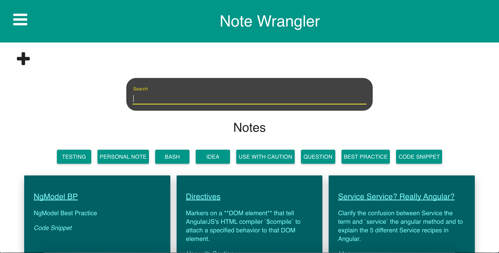
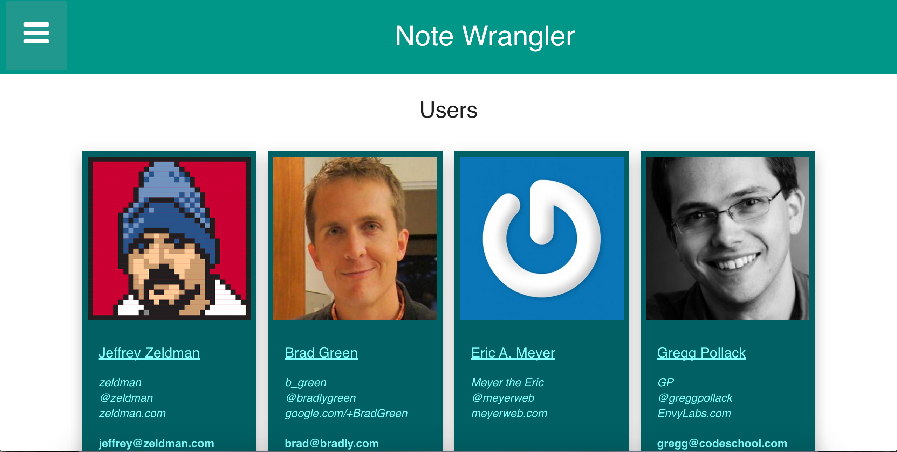
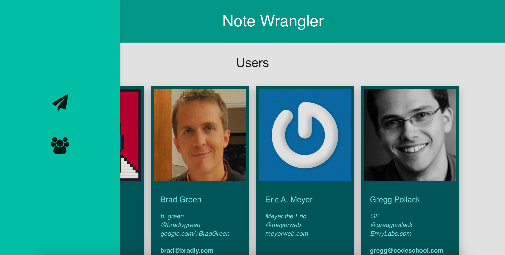

This is the note wrangler application implemented using material design. Used code school's S2B initial starting branch for the backend.

To start a local server run npm start and browse to localhost:8000 for the index page

